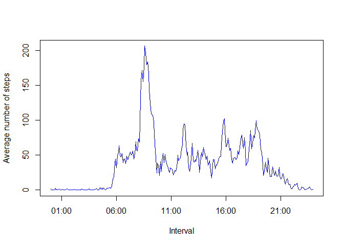
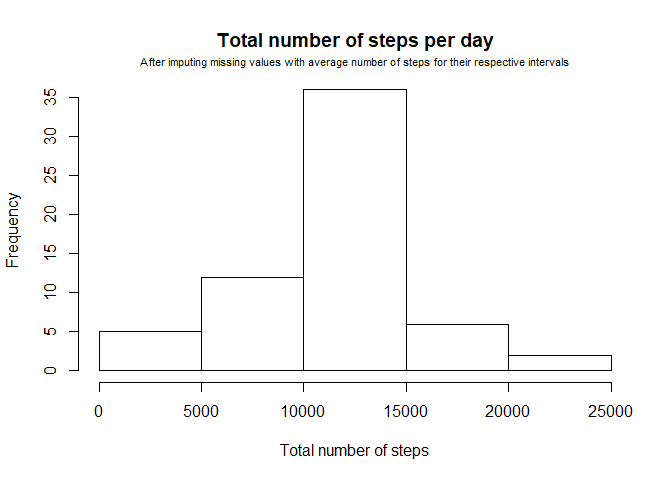
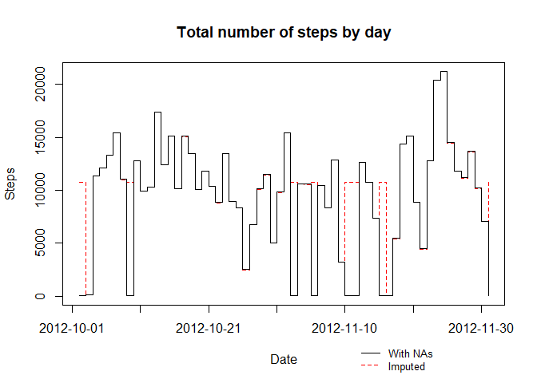
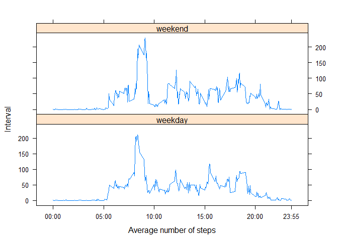

# Reproducible Research - Project Assignment #1
Igor Calado  
July 2, 2017  

## General

This document is a report written in R Markdown as part of the Project Assignment #1 for the course Reproducible Research (Coursera/Johns Hopkins).


## Loading and preprocessing the data

We'll start by loading libraries and changing settings.

```r
library(knitr)
opts_chunk$set(echo = TRUE,
               message = FALSE)
Sys.setlocale("LC_TIME", "English")
```

```
## [1] "English_United States.1252"
```

```r
library(dplyr)
library(lattice)
options(scipen = 999,
        digits = 2)
```

Now, let's store the data in a data.frame

```r
activity <- read.csv("activity.csv")
```

We're ready to begin working!

## What is the mean total number of steps taken per day?

### Calculate the total number of steps taken per day

To answer this question, we first have manipulate the data in order to create a sum of the total number of steps taken throughout all intervals in a day. We'll do it using *dplyr*.

The next chunk of code does the following:  
a) takes the data set *activity* and *splits* it by its column *date*;  
b) *applies* *select* to each data frame and keeps only the *steps* column;  
c) *applies* *sum* to every data frame, summing all the rows and keeping only the total number of steps by data frame/day (missing values are removed);  
d) the resulting list of data frames is then *unlisted*, resulting in a final list of total number of steps per day;  
e) the result is stored to the object *steps*.


```r
steps <- activity %>%
  split(activity$date) %>%
  lapply(select, steps) %>%
  lapply(sum, na.rm = T) %>%
  unlist

print(steps)
```

```
## 2012-10-01 2012-10-02 2012-10-03 2012-10-04 2012-10-05 2012-10-06 
##          0        126      11352      12116      13294      15420 
## 2012-10-07 2012-10-08 2012-10-09 2012-10-10 2012-10-11 2012-10-12 
##      11015          0      12811       9900      10304      17382 
## 2012-10-13 2012-10-14 2012-10-15 2012-10-16 2012-10-17 2012-10-18 
##      12426      15098      10139      15084      13452      10056 
## 2012-10-19 2012-10-20 2012-10-21 2012-10-22 2012-10-23 2012-10-24 
##      11829      10395       8821      13460       8918       8355 
## 2012-10-25 2012-10-26 2012-10-27 2012-10-28 2012-10-29 2012-10-30 
##       2492       6778      10119      11458       5018       9819 
## 2012-10-31 2012-11-01 2012-11-02 2012-11-03 2012-11-04 2012-11-05 
##      15414          0      10600      10571          0      10439 
## 2012-11-06 2012-11-07 2012-11-08 2012-11-09 2012-11-10 2012-11-11 
##       8334      12883       3219          0          0      12608 
## 2012-11-12 2012-11-13 2012-11-14 2012-11-15 2012-11-16 2012-11-17 
##      10765       7336          0         41       5441      14339 
## 2012-11-18 2012-11-19 2012-11-20 2012-11-21 2012-11-22 2012-11-23 
##      15110       8841       4472      12787      20427      21194 
## 2012-11-24 2012-11-25 2012-11-26 2012-11-27 2012-11-28 2012-11-29 
##      14478      11834      11162      13646      10183       7047 
## 2012-11-30 
##          0
```

### Make a histogram of the total number of steps taken each day


```r
hist(steps)
```

<!-- -->

### Calculate and report the mean and median of the total number of steps taken per day


```r
mean.steps <- mean(steps)
median.steps <- median(steps)
```

The _mean_ number of steps taken per day is __9354.23__.  
The _median_ number of steps taken per day is __10395__.


## What is the average daily activity pattern?

### Make a time series plot (i.e. type = "l") of the 5-minute interval (x-axis) and the average number of steps taken, averaged across all days (y-axis)

The next code chunk performs the following tasks:  
a) *splits* the data frame *activity* by its column *interval*;  
b) *applies* *select* to every data frame, keeping only the column *steps*;  
c) *applies* *colMeans* to every data frame, returning a list with the mean number of steps for every interval (NAs removed);  
d) stores the results in a list called *interval*.


```r
interval <- activity %>%
  split(activity$interval) %>%
  lapply(select, steps) %>%
  lapply(colMeans, na.rm = T)

head(interval, 5)
```

```
## $`0`
## steps 
##   1.7 
## 
## $`5`
## steps 
##  0.34 
## 
## $`10`
## steps 
##  0.13 
## 
## $`15`
## steps 
##  0.15 
## 
## $`20`
## steps 
## 0.075
```

In order to plot the interval against its average number of steps, we had to create a new vector with the names for the intervals in character format and written as HH:mm. It was used in place of the interval column, which was a factor variable. This was done to allow an easy conversion to a data/time object.

We did it through the use of a *for loop* and nested *if else* statements. The following code extracts the original name of the interval and transforms it according to the number of characters, so 5 becomes 00:05, 25 becomes 00:25, 555 becomes 05:55 and 2005 becomes 20:05. After the transformation, the strings are stored in the object *hour.minute.z*, an empty vector created before running the loop.

After the loop ends, *hour.minute.z* is converted to date/time through *strptime* and stored in the vector *hour.minute* (we experienced trouble when making the conversion inside the loop).


```r
hour.minute.z <- vector(length = length(interval))

for (i in 1:length(interval)) {
  
  text <- names(interval)[i]
  
  if (nchar(text) == 1) {
    text <- paste("00:0", text, sep = "")
  } else if (nchar(text) == 2) {
    text <- paste("00:", text, sep = "")
  } else if (nchar(text) == 3) {
    hour <- substr(text, 1, 1)
    minute <- substr(text, 2, 3)
    text <- paste(0, hour, ":", minute, sep = "")
  } else if (nchar(text) == 4) {
    hour <- substr(text, 1, 2)
    minute <- substr(text, 3, 4)
    text <- paste(hour, minute, sep = ":")
  }
  hour.minute.z[i] <- text
}

hour.minute <- strptime(hour.minute.z, format = "%H:%M")

str(hour.minute.z)
```

```
##  chr [1:288] "00:00" "00:05" "00:10" "00:15" "00:20" ...
```

```r
str(hour.minute)
```

```
##  POSIXlt[1:288], format: "2017-07-02 00:00:00" "2017-07-02 00:05:00" ...
```

Let's create a new table that is in the right format to be plotted. The next chunk does the following:  
a) creates a new data frame by putting together *hour.minute* (with the names that we just created for the intervals) and the numbers of *total average steps* (from a vector created by *unlisting* *interval*);  
b) renames its columns;  
c) stores the new data frame to *int.table*.


```r
int.table <- data.frame(hour.minute,
                        unlist(interval)) %>%
  rename(Interval = hour.minute,
         Average.steps = unlist.interval.)
```

Now we can finally move on to the plotting phase.


```r
plot(int.table,
     col = "blue",
     type = "l",
     ylab = "Average number of steps")
```

<!-- -->

### Which 5-minute interval, on average across all the days in the dataset, contains the maximum number of steps?

We'll answer this by first reordering *int.table* with the function *arrange* according to the its *Average.steps* column; then, with the use of *tail*, we take only the bottom of the increasing table to create.


```r
tail.intervals <- int.table %>%
  arrange(Average.steps) %>%
  tail(n =1)
```

Next, we create two objects, one with the name of the interval of highest average and another with its average of steps.


```r
max.interval <- tail.intervals[[1]] %>%
  as.character %>%
  strsplit(split = " ") %>%
  unlist %>%
  `[`(2) %>%
  substr(1,5)

max.steps <- tail.intervals[[2]]
```

The interval which has the highest average number of steps is __08:35__, with a total average of 206.17 steps.


## Imputing missing values

### Calculate and report the total number of missing values in the dataset (i.e. the total number of rows with NAs)


```r
NA.steps <- sum(is.na(activity$steps))
NA.percent <- NA.steps * 100 / nrow(activity)
```

The total number or rows with missing values is __2304__, 13.11% of the total.

### Devise a strategy for filling in all of the missing values in the dataset. Create a new dataset that is equal to the original dataset but with the missing data filled in.

We will substitute the missing values with the average number of steps for each given interval.

First, let's create a new data set called *activity.2*, identical to *activity*.


```r
activity.2 <- activity
```

Now, we'll iterate through each row of this new data set using a *for loop*. In each loop, an *if statement* will analyze if the the number of steps equals NA. If that's the case, then it'll find the position of the corresponding interval in the *interval* list and extract the average number of steps for that interval stored in the list. It will then assign that value to the place where the missing value was.


```r
for (i in 1:nrow(activity.2)) {
  if (is.na(activity.2[i,1])) {
    position <- match(activity.2[i,3], names(interval))
    activity.2[i,1] <- interval[position]
  }
}
```

### Make a histogram of the total number of steps taken each day and calculate and report the mean and median total number of steps taken per day.

The next code chunk does the following:  
a) splits *activity.2* in separate data frames according to the *date* variable;  
b) *applies* *select* to the *step* column of every data frame;  
c) *sums* the number of steps in each interval of that day in order to return a total result of steps by date;  
d) *unlists* the previous result, creating a vector *steps.2*.


```r
steps.2 <- activity.2 %>%
  split(activity.2$date) %>%
  lapply(select, steps) %>%
  lapply(sum, na.rm = F) %>%
  unlist
```

Let's create a histogram and annotate it properly.


```r
hist(steps.2,
     main = "Total number of steps per day",
     xlab = "Total number of steps")
mtext("After imputing missing values with average number of steps for their respective intervals",
      cex = 0.7,
      line = 0.5)
```

<!-- -->


```r
mean.steps.2 <- mean(steps.2)
median.steps.2 <- median(steps.2)
```

After the imputing of the missing values, the _mean_ number of steps taken per day is __10766.19__ and the _median_ number of steps taken per day is __10766.19__.

### Do these values differ from the estimates from the first part of the assignment? What is the impact of imputing missing data on the estimates of the total daily number of steps?

Both mean and median values differ.

The *mean* number of steps taken per day before and after the imputing was respectively __9354.23__ and __10766.19__. There was a 15.09% increase.

The *median* number of steps taken per day before and after the imputing was respectively __10395__ and __10766.19__. There was a 3.57% increase.


```r
total.steps <- sum(steps)
total.steps.2 <- sum(steps.2)
```

The *total* number of steps was __570608__ before the imputing and __656737.51__ afterwards. Hence, there was a 15.09% increase

Most daily counts were little affected, but a few of them had dramatic changes due to the high number of missing values. The first day, 2012-10-01, for instance, only had NAs in the original data set. Its total count of steps rose from 0 to 126.

The following superimposed staircase-type plot shows the differences in the daily total number of steps before and after the imputation.

The next code chunk does the following:  
a) *plots* the data after the imputation (*steps.2*) as a dashed red line in staircaisy-style;  
b) annotates its x-axis with the position and labels for the tick marks;  
c) calls  in order to superimpose the next plot to the one already plotted;  
d) plots the original data set (*steps*) as a black continuous line over the previous plot;  
e) creates a *legend*.


```r
plot(steps.2,
     type = "s",
     col = "red",
     lty = 2,
     lwd = 1,
     xaxt = "n",
     ylab = "Steps",
     xlab = "Date",
     main = "Total number of steps by day")

xtick <- seq(0, 60, by=10)
dates <- names(steps)[xtick + 1]
axis(side=1, at=xtick, labels = dates)

par(new=TRUE)
plot(steps,
     type = "s",
     lty = 1,
     lwd = 1,
     yaxt = "n",
     xaxt = "n",
     ylab = " ",
     xlab = " ")

legend("bottomright", 
       inset = c(0.15,-0.3),
       legend = c("With NAs","Imputed"),
       lty = c(1,2),
       col = c("black", "red"),
       bty = "n",
       xpd = TRUE,
       cex = 0.8)
```

<!-- -->


## Are there differences in activity patterns between weekdays and weekends?

### Create a new factor variable in the dataset with two levels - "weekday" and "weekend" indicating whether a given date is a weekday or weekend day.

The next code chunk does the following:  
a) takes *activity.2* (imputated data) and adds a new variable, *weekday*, created by transforming the *date* from factor to *Date* object;  
b) transforms each date in its corresponding *abbreviated weekday name* in English and stores the result to *activity.3*;  
c) run a *for* and *if* loop to change every weekday name to *weekend* (for "Sat" and "Mon") or *weekday* (else);  
d) transforms the *weekday* column to a factor variable with two levels.


```r
activity.3 <- activity.2 %>%
  mutate(weekday = as.Date(date)) %>%
  mutate(weekday = weekdays(weekday,  abbreviate = TRUE))

for (i in 1:nrow(activity.3)) {
  if (activity.3$weekday[i] == "Sat" |
      activity.3$weekday[i] == "Mon") {
    activity.3$weekday[i] <- "weekend"
  } else {
    activity.3$weekday[i] <- "weekday"
  }
}

activity.3$weekday <- as.factor(activity.3$weekday)
```

### Make a panel plot containing a time series plot (i.e. type = "l") of the 5-minute interval (x-axis) and the average number of steps taken, averaged across all weekday days or weekend days (y-axis).

First, let's manipulate the date so it can be easily plotted.

The next code chunk performs the following tasks:  
a) takes *activity.3* (which is a version of the original data set after imputing the missing values and creating the *weekday* variable) and splits it according to *wwekday*;  
b) *applies* the *group_by* function to every data frame to group it by *interval* name;  
c) *applies* *summarise* to take only the *mean* number of steps per interval by *weekday* factor;  
d) *renames* the *mean* column and stores the result to *stepz*.

*Stepz* is then a list with two grouped tibbles, which in turn are a list of mean steps for each interval.


```r
stepz <- activity.3 %>%
  split(activity.3$weekday) %>%
  lapply(group_by, interval) %>%
  lapply(summarise, mean(steps)) %>%
  lapply(rename, mean.steps = `mean(steps)`)
```

The next code chunk performs the following tasks:  
a) uses *mutate* to add a column with the string "weekday" to the *weekday* tibble of *stepz*;  
b) uses *mutate* to add a column with the string "weekend" to the *weekend* tibble of *stepz*;  
c) joins both tibbles *by row* in the data frame *stepzzz*.


```r
stepz[[1]] <- mutate(stepz[[1]], weekday = "weekday")
stepz[[2]] <- mutate(stepz[[2]], weekday = "weekend")
stepzzz <- rbind(stepz[[1]], stepz[[2]])
```

The next code chunk does the following:  
a) create a table called *hour.table* to pair the names of the intervals in the original set ("5") and its altered form ("00:05", in the vector *hour.minute.z*);  
b) creates a *sequence* named *ticks* of numbers where the tick marks of the plot will be;  
c) *matches* the numbers in *ticks* with its position in the table *hour.table*;  
d) calls *xyplot* from the *lattice* library to create a double-panel plot showing a time series of the average number of steps by interval and by factors *weekday/weekend*, passing tick positions and labels according to objects created in the previous step.


```r
hour.table <- cbind(names(interval), hour.minute.z)
ticks <- c(seq(0, 2355, 500), 2355)
tlabels <- match(ticks, hour.table)

xyplot(mean.steps ~ interval | weekday,
       stepzzz,
       type = "l",
       layout = c(1,2),
       ylab = "Interval",
       xlab = "Average number of steps",
       scales = list(x = list(at = ticks,
                              labels = hour.table[tlabels, 2])))
```

<!-- -->
